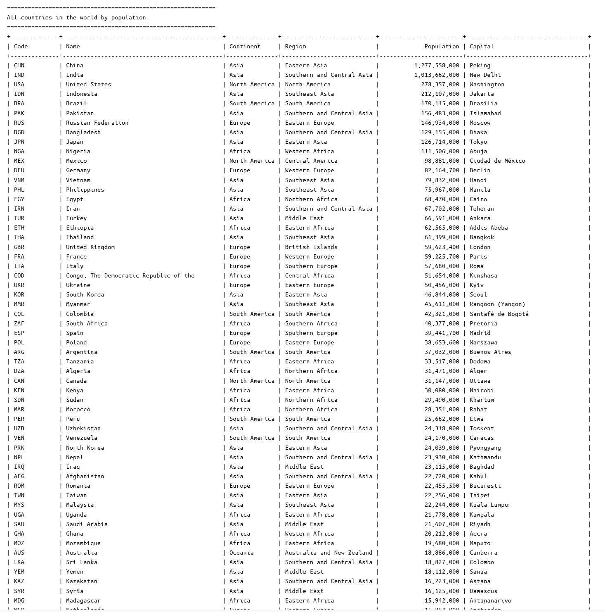
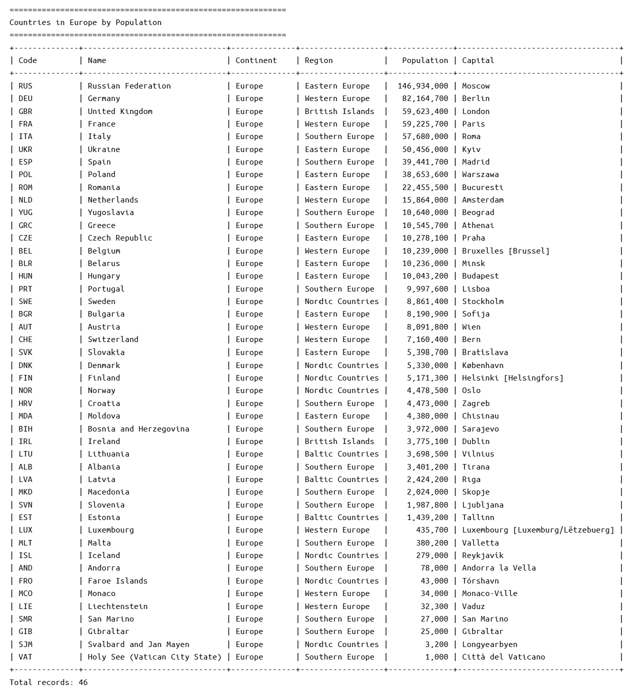
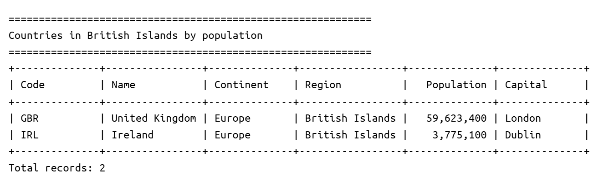
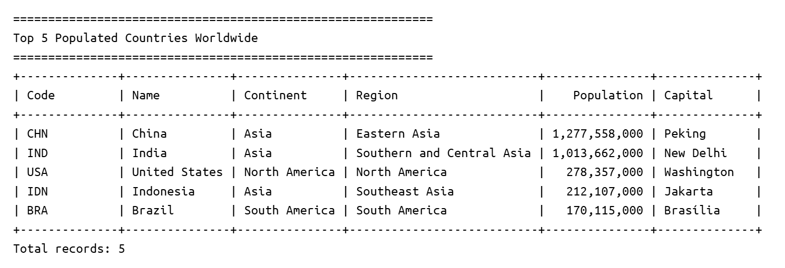
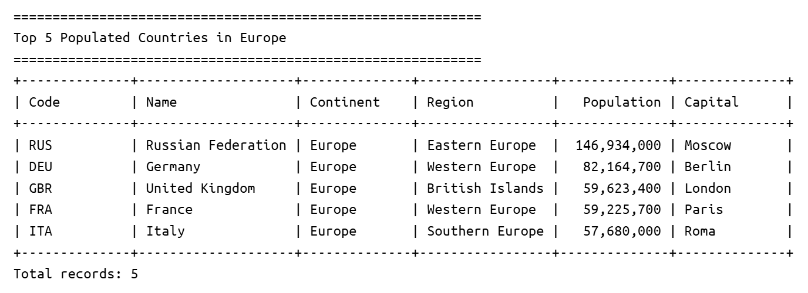
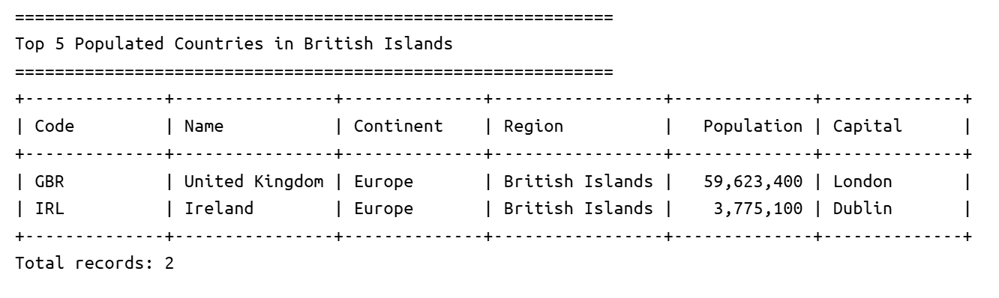

# Population Reporting System

## Project Overview

This project is a population reporting system developed by Team 14.

The system uses the MySQL `world` database to provide population reports for
countries, cities, capital cities, populations, and languages.

## Team Members

| Name | Role |
|---|---|
| Min Thu Myat | Product Owner |
| Ei Thadar Phyu | Scrum Master |
| Pai Thant Htoo | Team Member |
| Aung Kaung Myat | Team Member |
| Phyu Sin Theint | Team Member |
| Eaint Thazin Aung | Team Member |

## Technologies

- Java 21
- Maven
- MySQL 8
- Git & GitHub (GitFlow)
- GitHub Actions
- Docker & Docker Compose

## Requirements Met

6 requirements of 32 have been implemented, which is 18.75%.

| ID | Name | Met | Screenshot |
|----|------|-----|------------|
| 1 | All the countries in the world organised by largest population to smallest. | Yes |  |
| 2 | All the countries in a continent organised by largest population to smallest. | Yes |  |
| 3 | All the countries in a region organised by largest population to smallest. | Yes |  |
| 4 | The top N populated countries in the world where N is provided by the user. | Yes |  |
| 5 | The top N populated countries in a continent where N is provided by the user. | Yes |  |
| 6 | The top N populated countries in a region where N is provided by the user. | Yes |  |
| 7 | All the cities in the world organised by largest population to smallest. | No |  |
| 8 | All the cities in a continent organised by largest population to smallest. | No |  |
| 9 | All the cities in a region organised by largest population to smallest. | No |  |
| 10 | All the cities in a country organised by largest population to smallest. | No |  |
| 11 | All the cities in a district organised by largest population to smallest. | No |  |
| 12 | The top N populated cities in the world where N is provided by the user. | No |  |
| 13 | The top N populated cities in a continent where N is provided by the user. | No |  |
| 14 | The top N populated cities in a region where N is provided by the user. | No |  |
| 15 | The top N populated cities in a country where N is provided by the user. | No |  |
| 16 | The top N populated cities in a district where N is provided by the user. | No |  |
| 17 | All the capital cities in the world organised by largest population to smallest. | No |  |
| 18 | All the capital cities in a continent organised by largest population to smallest. | No |  |
| 19 | All the capital cities in a region organised by largest to smallest. | No |  |
| 20 | The top N populated capital cities in the world where N is provided by the user. | No |  |
| 21 | The top N populated capital cities in a continent where N is provided by the user. | No |  |
| 22 | The top N populated capital cities in a region where N is provided by the user. | No |  |
| 23 | The population of people, people living in cities, and people not living in cities in each continent. | No |  |
| 24 | The population of people, people living in cities, and people not living in cities in each region. | No |  |
| 25 | The population of people, people living in cities, and people not living in cities in each country. | No |  |
| 26 | The population of the world. | No |  |
| 27 | The population of a continent. | No |  |
| 28 | The population of a region. | No |  |
| 29 | The population of a country. | No |  |
| 30 | The population of a district. | No |  |
| 31 | The population of a city. | No |  |
| 32 | The number of people who speak Chinese, English, Hindi, Spanish and Arabic from greatest number to smallest, including the percentage of the world population. | No |  |